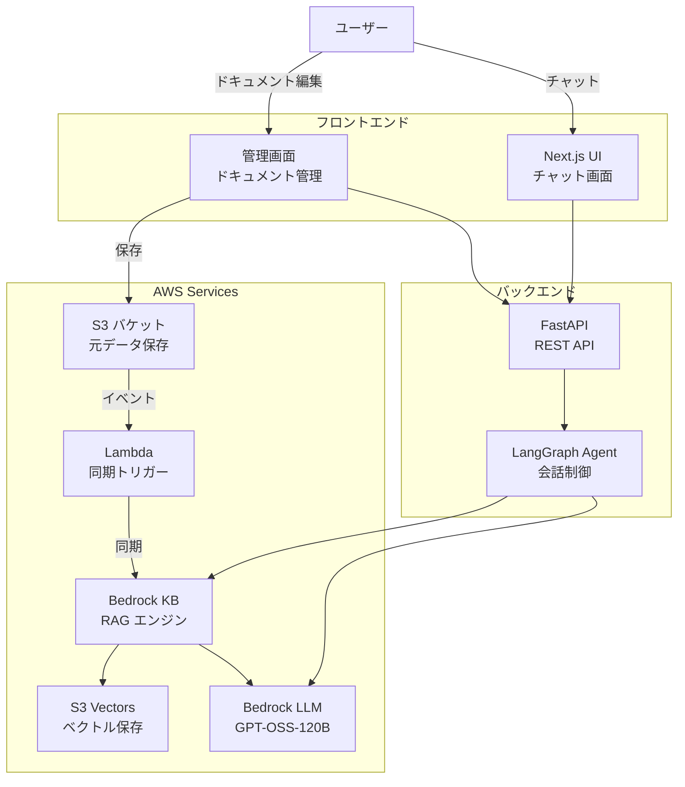
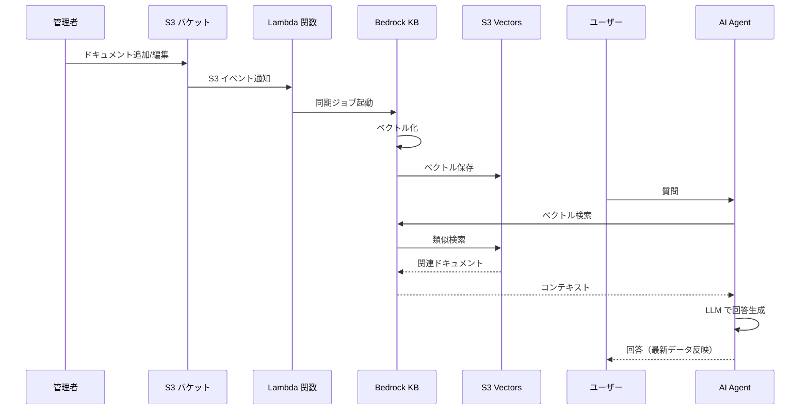

# RAG AI Agent

AWS Bedrock を活用した、エンタープライズグレードの RAG（Retrieval-Augmented Generation）対応 AI チャットシステム

[](https://github.com/ojagao/rag-ai-agent)

## 概要

本プロジェクトは、AWS の最新技術スタックを活用した AI エージェントシステムです。管理画面からドキュメントを管理し、リアルタイムでベクトル検索に反映される RAG 機能を備えています。

### 主な特徴

- 🤖 **LangGraph ベースのエージェント** - 柔軟な会話フローを実現
- 📚 **RAG 機能** - S3 Vectors + Bedrock Knowledge Bases による高速検索
- 🎨 **モダンな UI** - Next.js + Tailwind CSS によるダークモード対応
- 🔄 **リアルタイム同期** - ドキュメント更新を自動でベクトルDBに反映
- 📊 **可観測性** - LangSmith による実行トレース
- ☁️ **AWS ネイティブ** - フルマネージドサービスで運用負荷を最小化

## アーキテクチャ


### システム全体図



### RAG データフロー



## 技術スタック

### フロントエンド
- **Framework**: Next.js 15 (App Router)
- **Language**: TypeScript
- **Styling**: Tailwind CSS
- **UI Components**: React 19
- **HTTP Client**: Axios
- **Markdown**: react-markdown, remark-gfm

### バックエンド
- **Framework**: FastAPI
- **Language**: Python 3.11+
- **Agent**: LangGraph, LangChain
- **AWS SDK**: boto3
- **Validation**: Pydantic
- **Observability**: LangSmith

### AWS Services
- **LLM**: Amazon Bedrock (GPT-OSS-120B)
- **Embeddings**: Bedrock Titan Embeddings
- **Vector Store**: S3 Vectors
- **RAG Engine**: Bedrock Knowledge Bases
- **Storage**: Amazon S3
- **Compute**: AWS Lambda
- **Deployment**: AgentCore Runtime

## プロジェクト構成

```
rag-ai-agent/
├── backend/                 # Python バックエンド
│   ├── app.py              # FastAPI エントリーポイント
│   ├── agent/              # エージェントロジック
│   │   ├── core.py         # LangGraph 定義
│   │   ├── rag.py          # RAG 機能
│   │   └── config.py       # 設定管理
│   └── requirements.txt    # Python 依存関係
├── frontend/               # Next.js フロントエンド
│   ├── app/                # App Router
│   │   └── page.tsx        # チャット画面
│   └── components/         # React コンポーネント
│       ├── ChatMessage.tsx
│       ├── ChatInput.tsx
│       └── ChatContainer.tsx
├── docs/                   # ドキュメント
│   └── setup.md           # セットアップ手順
└── .env                    # 環境変数（要作成）
```

## 機能

### 現在利用可能
- ✅ リアルタイムチャット
- ✅ 会話履歴の保持
- ✅ Markdown レンダリング（テーブル、リスト、コードブロック）
- ✅ LangSmith トレーシング
- ✅ ダークモード UI

### 開発中（フェーズ9）
- 🚧 RAG 機能（S3 Vectors + Bedrock KB）
- 🚧 ドキュメント管理画面
- 🚧 リアルタイム同期

### 今後の予定
- 📋 AWS 本番環境デプロイ（S3 + CloudFront）
- 📋 認証機能（AWS Cognito）
- 📋 マルチユーザー対応

## ドキュメント

- [セットアップ手順](docs/setup.md) - ローカル環境構築
- [タスク管理](TASK.md) - 開発進捗
- [要件定義](REQUIREMENTS.md) - システム仕様
- [エージェントガイド](AGENTS.md) - AI エージェント向けガイド

## 作成者

[@ojagao](https://github.com/ojagao)

